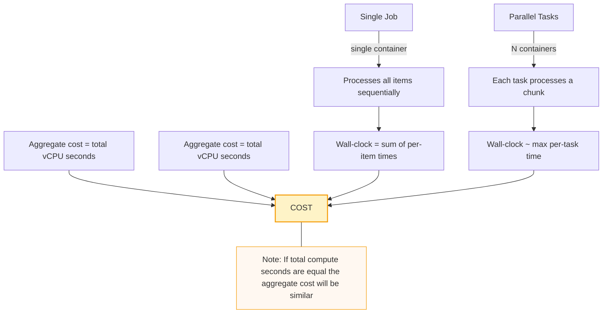
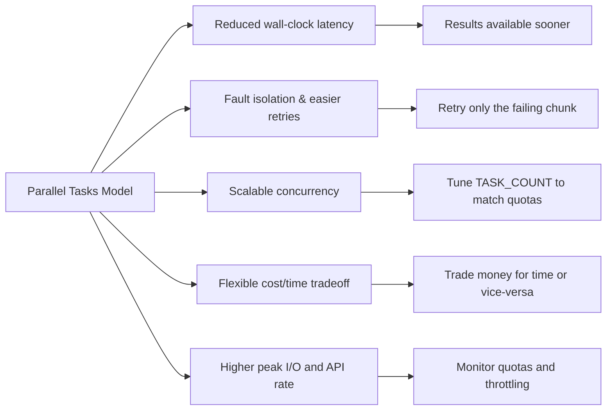

# My Simple Image Processing

A small GCS-only image processing utility that:
- Lists image objects under a GCS prefix (provided via `INPUT_FOLDER`).
- Splits work across tasks using `CLOUD_RUN_TASK_INDEX` / `CLOUD_RUN_TASK_COUNT`.
- Creates 100×100 thumbnails (preserving aspect ratio) using Pillow.
- Uploads thumbnails into a timestamped folder at the root of the same bucket:
  `gs://<bucket>/<TIMESTAMP>/<original_filename>`.

This repository contains:
- `process.py` — the main script run inside the container.
- `requirements.txt` — Python dependencies (`google-cloud-storage`, `Pillow`).
- `Procfile` — present for buildpack compatibility (not required if you use a Dockerfile).

Overview / design notes
- Input is strictly cloud storage. `INPUT_FOLDER` must be a `gs://` path (e.g. `gs://my-bucket/some/prefix`).
- The script identifies images using blob `content-type` (if present) or common filename extensions.
- Chunking (partitioning) is computed from the total number of discovered images and split across `TASK_COUNT` and `TASK_INDEX`.
- Output thumbnails are uploaded at the bucket root under a timestamp folder (minute precision), for example:
  `gs://my-bucket/20251203T1530Z/file.jpg`.
- The timestamp uses minute precision (format `YYYYMMDDTHHMMZ`) to group thumbnails into minute-level folders.

---

Mermaid diagrams and discussion: Tasks vs Single Job and benefits for batch processing

Below are three diagrams and accompanying explanations in the requested order:
1. Why use parallel tasks vs a single job
2. Benefits of using tasks for batch processing
3. Concrete batch example comparing a single job vs parallel tasks

---

1) Why prefer using parallel Cloud Run tasks instead of a single long-running job



Why this matters (short summary):
- Single-job: runs serially. Wall-clock is the sum of all per-item processing times — slow when many items.
- Parallel tasks: run N workers concurrently. Wall-clock approximates the slowest worker instead of the sum — much faster completion if work is balanced.
- Cost: providers charge for CPU and memory over time. If the total compute-time (CPU-seconds) is the same, aggregate cost is roughly the same. Parallelism trades time (latency) for concurrency (peak resource usage), not necessarily for higher aggregated cost.

---

2) Benefits of using tasks for batch processing



Key benefits:
- Reduced wall-clock latency: finish the batch faster by processing chunks concurrently.
- Fault isolation: only a task that fails needs a retry (less rework than rerunning the entire job).
- Scalability: increase `TASK_COUNT` to reduce completion time, constrained by quotas and service limits.
- Cost/time tradeoff: aggregate compute cost tends to remain similar; you can pay the same cost in less time (or longer for lower peak).
- Operational caution: parallel tasks increase peak network and API calls — watch Cloud Storage quotas and IAM service limits.

---

3) Concrete batch example (1000 images, N = 10 tasks)

```mermaid
flowchart LR
  subgraph single [Single Job]
    S0[Start] --> S1[Process 1000 images sequentially]
    S1 --> S2[Time = 1000 * t_item]
    S2 --> SC[Aggregate cost ~ 1000 * t_item * vCPU]
  end

  subgraph parallel [Parallel Tasks N=10]
    P0[Start] --> P1[Split into 10 chunks of 100]
    P1 --> P2[10 workers run concurrently]
    P2 --> P3[Time ~ 100 * t_item + overhead]
    P3 --> PC[Aggregate cost ~ 1000 * t_item * vCPU]
  end

  SC --> compare[Compare]
  PC --> compare
  compare --> note1[Wall-clock: parallel ~ 10x faster (ideal)]
  compare --> note2[Cost: roughly similar assuming same total compute]
```

Notes for the example:
- `t_item` = average time to process one item (download + resize + upload).
- With perfect balance and negligible overhead, parallelism reduces wall-clock roughly by factor `N`.
- Cost parity assumes negligible overhead; real-world factors (startup, retries, duplicate work) can increase total compute-seconds.
- Use this pattern when latency matters; for low-cost, low-peak resource usage and simplicity, sequential may be acceptable.

---

Practical recommendations
- If low latency matters: use parallel tasks and tune `TASK_COUNT` to meet completion-time goals while staying within quotas.
- If minimal operational complexity is desired and time isn't critical: a single job is simpler and may reduce peak resource demands.
- Always monitor Cloud Storage request rates, network bandwidth, and service quotas; increase quotas if you bump into limits.
- Avoid filename collisions when multiple tasks write identical filenames into the same timestamp folder:
  - Preserve source subpaths under the timestamp root (e.g., `<timestamp>/<original/prefix>/file.jpg`) or
  - Append a short task-specific suffix/hash to filenames, or
  - Write to a dedicated output bucket or per-task folder.
- Consider adding a small startup delay jitter or exponential backoff for retries to avoid thundering herd issues with high concurrency.

---

Remaining README content (build, run, troubleshooting, etc.)

Local testing with Docker
1. Inspect the image entrypoint and files:
```bash
docker inspect --format '{{.Config.Entrypoint}} {{.Config.Cmd}}' IMAGE_URI
```

List contents of the image:
```bash
docker run --rm --entrypoint ls IMAGE_URI -la /app
```

2. Run the image using the image's default entrypoint (simple test):
```bash
docker run --rm \
  -e INPUT_FOLDER=gs://my-bucket/path \
  -e PYTHONUNBUFFERED=1 \
  IMAGE_URI
```

3. Force-run `process.py` regardless of image entrypoint (recommended for debug):
```bash
docker run --rm \
  -e INPUT_FOLDER=gs://my-bucket/path \
  -e PYTHONUNBUFFERED=1 \
  --entrypoint python \
  IMAGE_URI process.py
```

4. Run with Google credentials (if you need GCS access from local):
```bash
docker run --rm \
  -e INPUT_FOLDER=gs://my-bucket/path \
  -e GOOGLE_APPLICATION_CREDENTIALS=/secrets/key.json \
  -e PYTHONUNBUFFERED=1 \
  -v /path/on/host/key.json:/secrets/key.json:ro \
  --entrypoint python \
  IMAGE_URI process.py
```

Build and push container image (recommended: Docker + Artifact Registry)
Example Dockerfile (create `Dockerfile` in repo root):
```dockerfile
FROM python:3.11-slim
WORKDIR /app
COPY requirements.txt .
RUN pip install --no-cache-dir -r requirements.txt
COPY . /app
ENTRYPOINT ["python", "process.py"]
```

Build & push example:
```bash
gcloud auth login
gcloud config set project YOUR_PROJECT_ID
REGION=us-central1
REPOSITORY=your-repo
IMAGE=your-image
TAG=latest
IMAGE_URI=LOCATION-docker.pkg.dev/YOUR_PROJECT_ID/$REPOSITORY/$IMAGE:$TAG

docker build -t $IMAGE_URI .
docker push $IMAGE_URI
```

Create and run a Cloud Run Job
Create the job (example):
```bash
gcloud run jobs create my-image-job \
  --image $IMAGE_URI \
  --region $REGION \
  --command python --args process.py
```
If your image already sets ENTRYPOINT to `python process.py`, you can omit `--command`.

Configure env vars (must set INPUT_FOLDER):
```bash
gcloud run jobs update my-image-job \
  --set-env-vars INPUT_FOLDER=gs://my-bucket/path,CLOUD_RUN_TASK_COUNT=4 \
  --region $REGION
```

Run the job:
```bash
gcloud run jobs run my-image-job --region $REGION
```

Notes on parallelism (chunking)
- The script partitions discovered images across `TASK_COUNT`. Each worker should be invoked with a distinct `CLOUD_RUN_TASK_INDEX` in `[0..TASK_COUNT-1]`.
- Cloud Run Jobs supports task-level parallelism; ensure your orchestrator or job configuration supplies the correct indices to workers.

Output layout and naming collisions
- Thumbnails are uploaded to the bucket root under a timestamp folder:
  `gs://<bucket>/<TIMESTAMP>/<original_filename>`
- Timestamp uses minute precision: `YYYYMMDDTHHMMZ` (UTC, no seconds).
- If multiple source files share the same filename and are processed in the same minute, consider preserving source subpaths or adding unique suffixes to avoid overwrites.

Troubleshooting tips
- Container exits immediately with no logs:
  - Inspect the image entrypoint/CMD with `docker inspect`.
  - Force-run Python (`--entrypoint python IMAGE_URI process.py`) to confirm the script runs.
  - Verify `process.py` exists in the image.
- Missing `INPUT_FOLDER`: the script exits early and prints an error. Ensure env var is set.
- Authentication errors: ensure the running service account has `storage.objects.get` and `storage.objects.create` permissions, or mount credentials during local testing.
- Memory/IO pressure: the script downloads each blob into memory; increase container memory or stream to disk if needed.

Extending the project
- Preserve source subpaths in the output folder (recommended for collision avoidance).
- Add an `OUTPUT_BUCKET` env var to write thumbnails to a separate bucket.
- Make image detection more robust by validating file contents (tradeoff: extra downloads).
- Add per-task concurrency or batching inside a worker, carefully balancing memory and network I/O.

Files of interest
- `process.py` — main logic (GCS listing, chunking, Pillow processing, upload).
- `requirements.txt` — required Python packages.
- `Dockerfile` — recommended to control image ENTRYPOINT.

If you want, I can:
- Export the Mermaid diagrams to PNG/SVG and add them to the repo for viewers that don't render Mermaid.
- Add a Dockerfile to the repo and a small Makefile to build/push/run the Cloud Run Job.
- Modify `process.py` to preserve sub-paths under the timestamp folder or add an `OUTPUT_BUCKET` option.